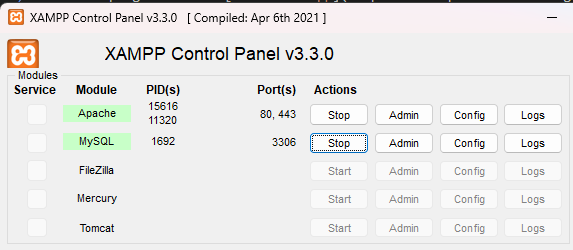
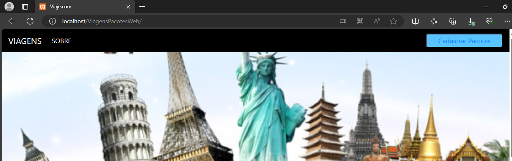
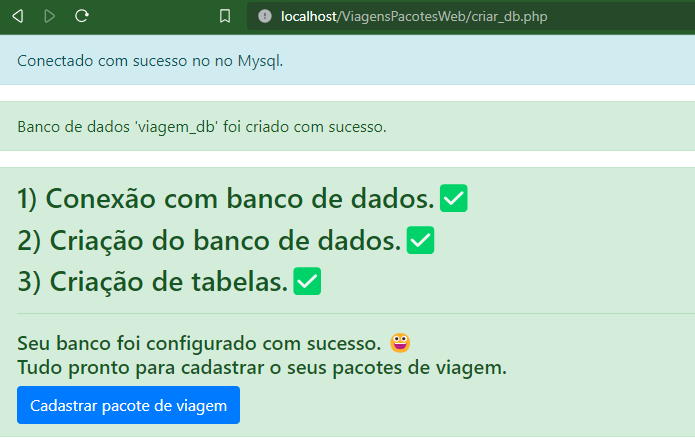

# ViagensPacotesWeb
**Trabalho faculdade**
Professor: Samuel Zanferdini Oliva

**COMO RODAR LOCALMENTE ESSE PROJETO**

1) Instale o programa XAMPP [baixe o xampp](https://www.apachefriends.org/pt_br/download.html)

2) Depois do XAMPP instalado salve o projeto na pasta htdocs.   
   No windows o caminho geralmente é C:\xampp\htdocs  
   Mas isso vai depender do caminho que você instalou o XAMPP. 
   Recomendamos fazer a instalação padrão do XAMPP. 

3) Com o XAMPP instado e o projeto dentro da pasta **htdcs** você deve ativar o servidor do Apache e Mysql.
   Veja a imagem abaixo.👇

4) Depois de ativar o servidor Apache e Mysql. Rode o projeto.
   No seu navegador digite: http://localhost/ViagensPacotesWeb/
   Se tudo estive correto a página abaixo vai carregar.

   

5) Criando o banco de dados. 
   Para criar o banco de dados execute o programa em PhP criar_db.php no seu navegador. 
   http://localhost/ViagensPacotesWeb/criar_db.php  
   [Ou clique aqui para executar](http://localhost/ViagensPacotesWeb/criar_db.php) 
   Se tudo estive correto você vai receber uma mensagem informado que o banco foi configurado com sucesso. 
   Você pode confirmar também a criação do seu banco acessando o PhPMyAdmin.
   Caso aconteça algum erro de conexão com seu banco, você deve modificar as credencias de acesso ao banco no aquivo criar_db.php 
   Por padrão  estamos usando essa configuração de acesso ao banco.
    
   ` $servidor_db ="localhost"; 
     $usuario_db="root"; 
     $senha_db="";` 

   

     

 
   